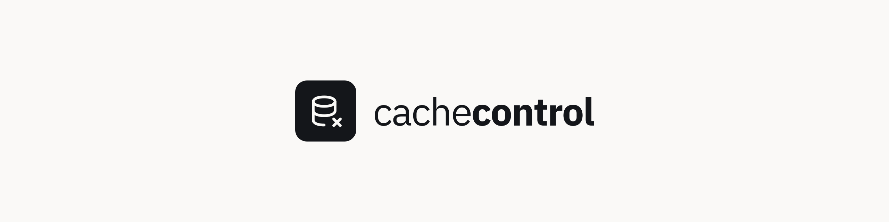

<p align="center">
    <picture>
        <source media="(prefers-color-scheme: dark)" srcset="assets/cachecontrol-banner-on-dark-2560x640.png">
        <source media="(prefers-color-scheme: light)" srcset="assets/cachecontrol-banner-on-light-2560x640.png">
        
    </picture>
</p>

&nbsp;

<p align="center">
    An extension for Firefox, Chrome, and Edge that disables the browser cache for the websites you name.
</p>

<p align="center">
    <a href="https://github.com/braycarlson/cachecontrol/actions/workflows/ci.yml"></a>
    <a href="https://www.typescriptlang.org"></a>
    <a href="LICENSE"></a>
</p>

A rule covers one URL, and each rule carries its own protocols and its own resource types, so you decide whether it touches images, scripts, stylesheets, or everything. A rule that names a port matches that port alone, and a rule without one matches every port on the host.

A rule also carries a display name and belongs to at most one group. Groups are created, renamed, and deleted under Groups. The rules list draws a heading for each group with the ungrouped rules last, each heading counts the rules under it and collapses them, and the filter matches a URL, a name, or a group. Deleting a group keeps every rule it held and leaves them ungrouped, and renaming one carries them along.

There are three ways to put a rule in a group. Drag it there by the handle on its row, pick the group from the select in the rule editor, or check it off against a group under Groups, which is the way to move several rules at once.

## How It Works

A rule rewrites the cache headers on every request and response that matches it, so a reload fetches from the network instead of the browser cache. There are four headers a rule sets.

| Header | Value |
|---|---|
| `Cache-Control` | The value is `no-store, no-cache, must-revalidate, proxy-revalidate`. |
| `Expires` | The value is `0`. |
| `Pragma` | The value is `no-cache`. |
| `Surrogate-Control` | The value is `no-store`. |

There is one codebase and two engines. The Firefox build is Manifest V2 and rewrites headers through blocking `webRequest`. The Chrome build is Manifest V3 and rewrites them through `declarativeNetRequest`, because Chrome removed blocking `webRequest` from Manifest V3. Edge loads the Chrome build unchanged. The background entry picks the engine from the APIs the browser exposes, so one entry serves both bundles.

A rule cannot evict a response the browser cached before the rule existed. Clear the cache once after adding one.

## Development

The extension is built with Vite, Vue, and Tailwind CSS. The toolchain is Bun.

```sh
bun install
bun run dev
```

The `dev` script launches Firefox with the extension loaded and rebuilds on change.

| Script | Description |
|---|---|
| `bun run build` | Builds both targets into `dist/firefox` and `dist/chrome`. |
| `bun run build:firefox` | Builds the Firefox target alone. |
| `bun run build:chrome` | Builds the Chrome target alone, which Edge also loads. |
| `bun run check` | Type checks, lints, and runs the unit suite. |
| `bun run coverage` | Runs the unit suite with a coverage report. |
| `bun run e2e` | Runs both end to end suites against real browsers. |
| `bun run package` | Builds both targets and writes a store zip for each. |
| `bun run screenshot` | Rewrites the store screenshots in `assets` at 1280x800. |

The `TARGET` environment variable picks the target a single Vite run builds. It defaults to `firefox`, and `chrome` is the only other value. The manifest is one template: a key prefixed `{{firefox}}.` survives only in the Firefox build, and a key prefixed `{{chrome}}.` only in the Chrome build.

The `typescript` dependency is pinned at 6.0.3. TypeScript 7 drops the compiler API that typed lint and `vue-tsc` depend on, so an upgrade breaks `bun run check`.

## Loading The Build

Firefox loads the Manifest V2 build from `dist/firefox`.

- Open `about:debugging`, press "This Firefox", click "Load Temporary Add-on...", and open `dist/firefox/manifest.json`.

Chrome and Edge load the Manifest V3 build from `dist/chrome`.

- Open `chrome://extensions` or `edge://extensions`, turn on developer mode, click "Load unpacked", and choose the `dist/chrome` directory.

## Testing

There are two layers. The unit suite runs under Vitest against an in-memory browser, and it covers the rule parser, the storage layer, both engines, the composables, and every component. The end to end suites drive real browsers against a logging HTTP server and assert on the requests that reach it, because a cache hit never leaves the browser and a request count is the only trustworthy signal.

```sh
bun run check
bun run e2e
```

The chromium suite runs under Playwright against `dist/chrome`. The firefox suite runs under `web-ext` against `dist/firefox`, and the test page drives its own reloads, because a start URL races the temporary add-on install.

Every image below is written by `bun run screenshot`, which loads the built Chrome bundle under Playwright, seeds a demo profile, and captures each screen at 1280x800, the size the Chrome and Edge stores take.

## Popup


## Rules


## Rule Editor


## Groups


## Presets

